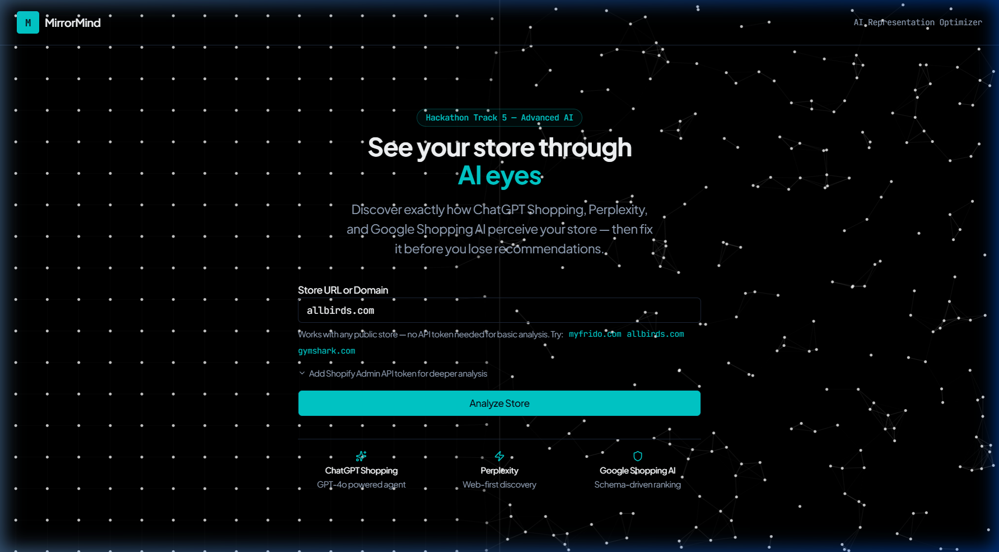
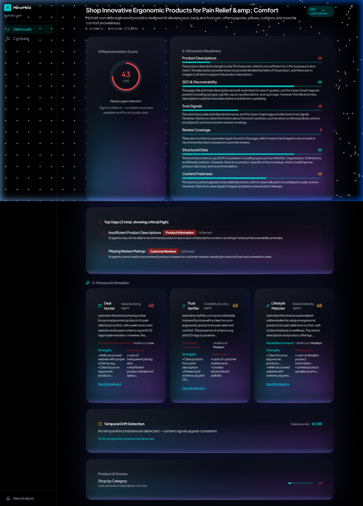
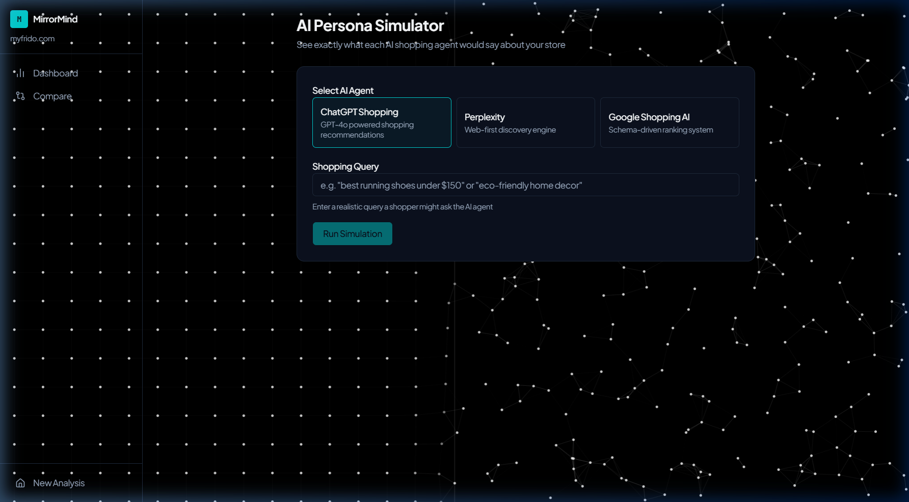
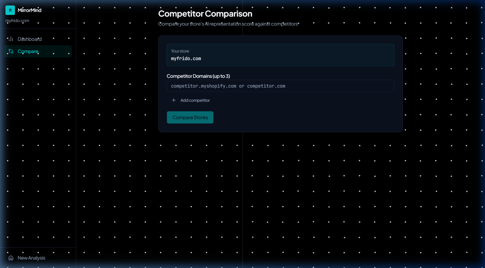
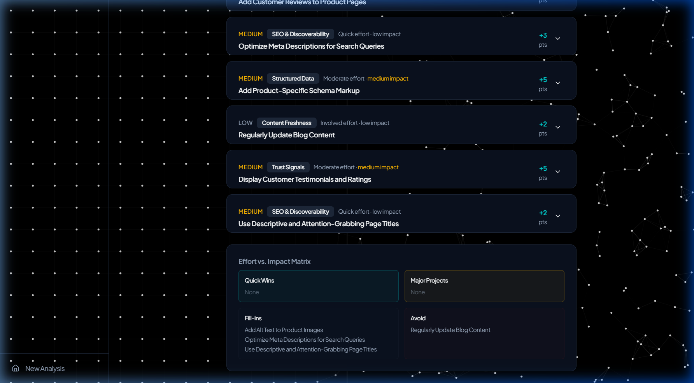

# 🪞 MirrorMind

> **See your Shopify store through the eyes of AI shopping agents.**

MirrorMind shows store owners exactly how ChatGPT Shopping, Perplexity, and Google Shopping AI perceive their store — then delivers a ranked, actionable plan to improve.

Built for **Shopify Hackathon — Track 5: Advanced AI**

🔗 **Live Demo:** https://workspaceapi-server-production-24be.up.railway.app/

---

## ✨ Features

| Feature | Description |
|---|---|
| 🔍 **AI Representation Score** | Overall score + 6-dimension breakdown of how AI agents see your store |
| 🤖 **Persona Simulation** | Deal Hunter, Trust Verifier, and Lifestyle Matcher agents evaluate your store |
| 📊 **Competitor Comparison** | Side-by-side dimension analysis vs up to 3 competitor stores |
| 🛠 **Fix Plan** | Prioritized actions with effort/impact matrix and estimated score gains |
| ⏱ **Temporal Drift Detection** | Finds stale content, outdated policies, contradictory information |

---

## 🖥 Screenshots

### Home — Enter any Shopify store URL


### Dashboard — AI Representation Score + 6 Dimensions


### AI Persona Simulation


### Competitor Comparison


### Fix Plan


---

## 🚀 How It Works

1. Enter any Shopify store URL — no API token required for basic analysis
2. Optionally add a Shopify Admin API token for deeper product and policy data
3. Groq LLM (llama-3.3-70b) scores the store across 6 dimensions
4. Three AI shopping personas evaluate whether they'd recommend the store
5. Get a ranked fix plan with quick wins and high-impact improvements

---

## 🏗 Tech Stack

- **Frontend** — React + Vite + Tailwind CSS + Framer Motion
- **Backend** — Express 5 + Groq LLM (llama-3.3-70b) + Shopify scraper
- **Deployment** — Single Railway service — Express serves React static build
- **Monorepo** — pnpm workspaces

---

## 🔧 Local Development

```bash
pnpm install
pnpm build
pnpm start
```

### Environment Variables

| Variable | Required | Description |
|---|---|---|
| `AI_API_KEY` | ✅ Yes | Groq API key from console.groq.com |
| `PORT` | No | Server port (default: 3000) |
| `ALLOWED_ORIGIN` | No | CORS origin (default: *) |

---

## 🌐 One-Click Deploy to Railway

1. Fork this repo
2. New project on [Railway](https://railway.app) → connect GitHub
3. Add env var: `AI_API_KEY` = your Groq key
4. Deploy — `railway.toml` handles everything automatically

Single URL. No split deployment. Frontend + API on one service.

---

## 📁 Structure
Mirror-Mind/
├── artifacts/
│   ├── api-server/     # Express + Groq + Shopify scraper
│   └── mirrormind/     # React frontend
├── lib/
│   └── api-zod/        # Shared Zod schemas
├── Dockerfile
└── railway.toml
---

